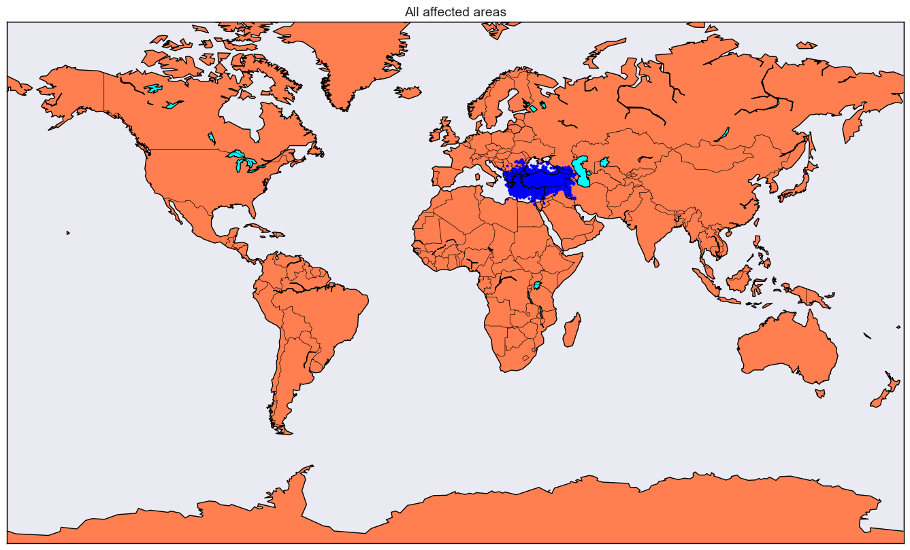
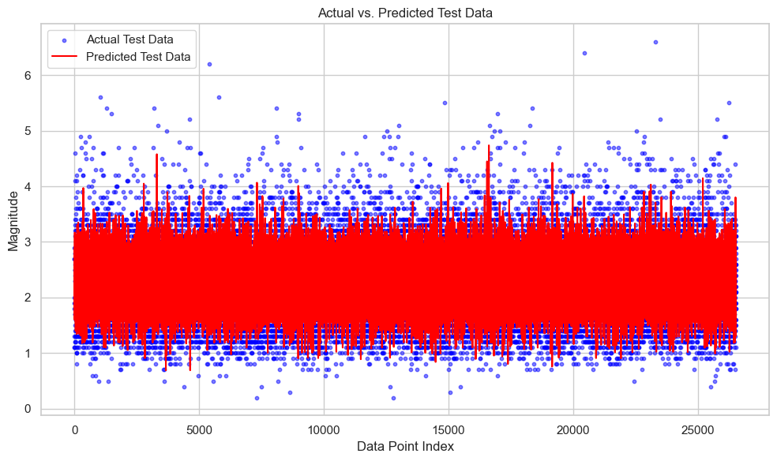
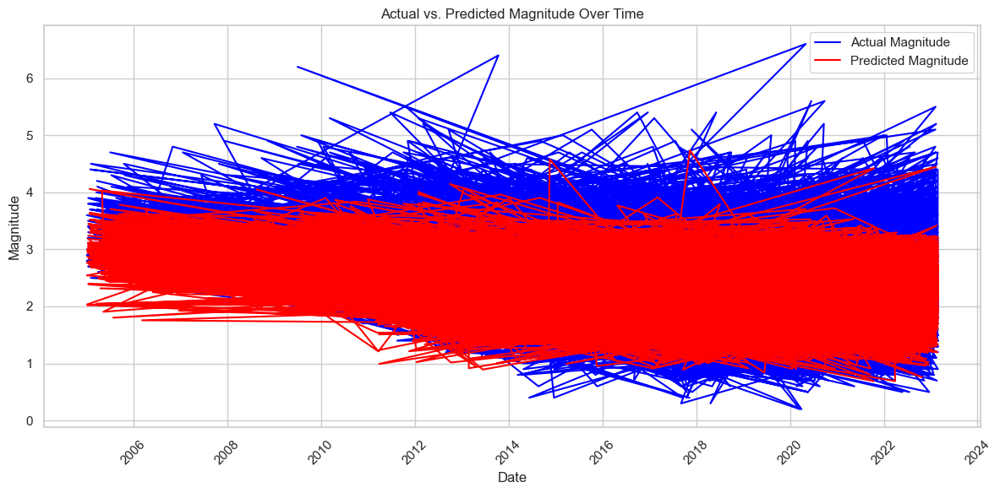
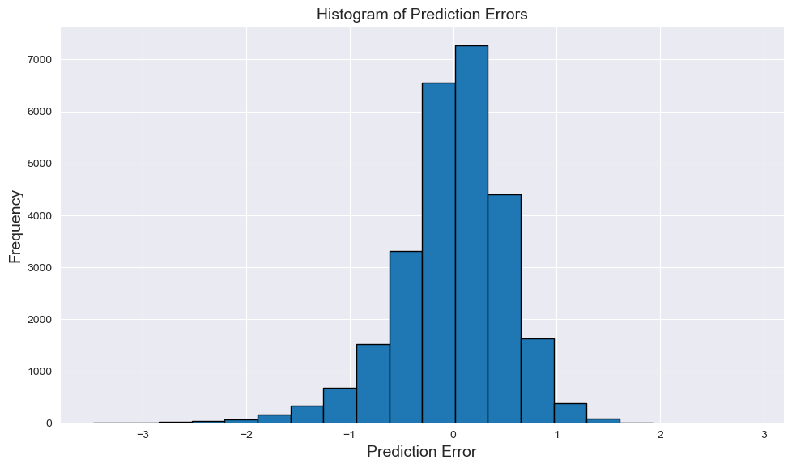
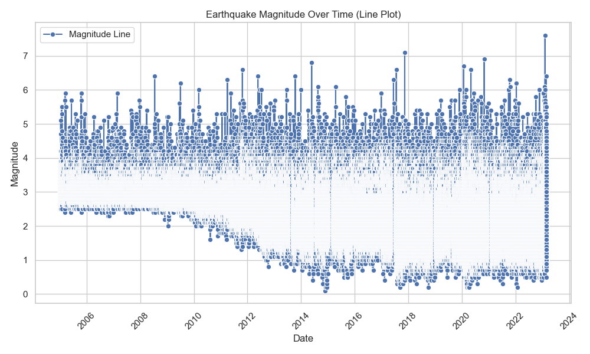
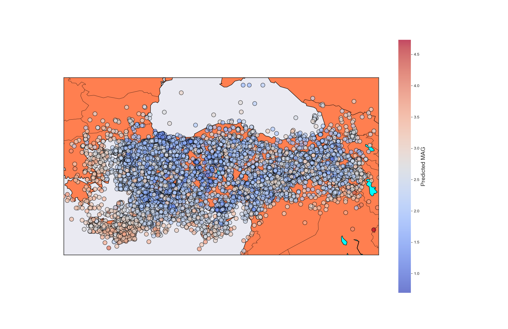

# TR Earthquake AI Project



## Table of Contents

- [Introduction](#introduction)
- [Project Overview](#project-overview)
- [Installation](#installation)
  - [Using Conda](#using-conda)
  - [Using Pip](#using-pip)
- [Usage](#usage)
- [Data](#data)
- [Features](#features)
- [Model](#model)
- [Results](#results)
- [Contributing](#contributing)
- [License](#license)
- [Acknowledgments](#acknowledgments)

## Introduction

Welcome to the [TR Earthquake AI project!](ProjectAIEarthquake.ipynb) This project utilizes machine learning and artificial intelligence techniques to predict and analyze earthquakes using earthquake data from Turkey.

## Project Overview

In this project, we aim to:

- Predict earthquake magnitudes and locations.
- Analyze seismic data to identify patterns and trends.
- Provide valuable insights for earthquake preparedness and mitigation.

## Installation

### Using Conda

1. Clone the repository:

   ```bash
   git clone https://github.com/prgrmcode/tr-earthquake-predictor.git
   ```

2. Navigate to the project directory:

   ```bash
   cd tr-earthquake-predictor
   ```

3. Create a Conda environment:

   ```bash
   conda env create -f environment.yml
   ```

4. Activate the Conda environment:

   ```bash
   conda activate earthquake-ai
   ```

### Using Pip

1. Clone the repository:

   ```bash
   git clone https://github.com/yourusername/earthquake-ai-project.git
   ```

2. Navigate to the project directory:

   ```bash
   cd earthquake-ai-project
   ```

3. Create a Python virtual environment (optional but recommended):

   ```bash
   python -m venv venv
   ```

4. Activate the virtual environment:

   - On Windows:

     ```bash
     venv\Scripts\activate
     ```

   - On macOS and Linux:

     ```bash
     source venv/bin/activate
     ```

5. Install project dependencies:

   ```bash
   pip install -r requirements.txt
   ```

## Usage

To use the Earthquake AI project, follow these steps:

1. **Data Preparation**: Prepare your earthquake data in the required format. You can use the provided dataset or integrate your data.

2. **Data Preprocessing**: Clean and preprocess the data using the provided sections on Jupyter notebook.

3. **Model Training**: Train the machine learning models using the preprocessed data. You can use the provided scripts.

4. **Predictions**: Use the trained models to make earthquake predictions.

5. **Data Visualization**: Visualize earthquake patterns, trends, and predictions using the provided visualization tools.

## Data

The project uses earthquake data from Turkey, including features like date, location, latitude, longitude, magnitude, depth, and more. The dataset is available in the `data` directory and in dataset location: https://www.kaggle.com/datasets/serhatk/turkey-20-years-earthquakes-csv.

Please unzip the dataset and place it in the root directory.

## Features

- **DATE\_**: The date of the earthquake event.
- **LOCATION\_**: The location of the earthquake.
- **LAT**: The latitude coordinate of the earthquake.
- **LNG**: The longitude coordinate of the earthquake.
- **MAG**: The magnitude of the earthquake.
- **DEPTH**: The depth at which the earthquake occurred.
- **RECORDDATE**: The date at which the earthquake recorded to dataset.

## Model

We use machine learning models to predict earthquake magnitudes. The models are trained on historical earthquake data and is available in the `'VI. Experiment with Multiple Regression Models'` section of the [Jupyter notebook](ProjectAIEarthquake.ipynb).

## Results

Our model achieved impressive results in earthquake prediction. We provide details of our model's performance in the `results_best_model` directory and `'X. Using best model XGBRegressor with the best Hyperparameters to make predictions on new data'` section of the 'ProjectAIEarthquake.ipynb' Jupyter Notebook.

You can find the map of predicted MAG values:
[Map of Predicted MAG values](./docs/index.html)













## Contributing

Contributions to this project are welcome! You can contribute by:

- Reporting issues or bugs.
- Adding new features or enhancements.
- Improving documentation.
- Providing insights and suggestions.

Please follow our [contributing guidelines](CONTRIBUTING.md) for more details.

## License

This project is licensed under the [Apache-2.0 license](LICENSE).

## Acknowledgments

We would like to thank the open-source community for their contributions and the earthquake data providers AFAD agency for making their data available. Also thanks to the account holders of kaggle dataset: https://www.kaggle.com/datasets/serhatk/turkey-20-years-earthquakes-csv

---
